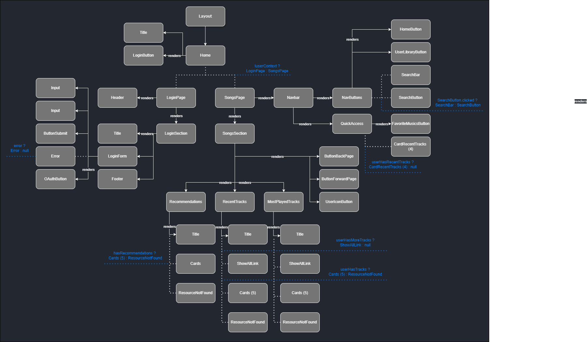

# 1. Visão Geral do Projeto

O Projeto Dunder Mifflin Playlists é  uma aplicação Front-End que permite aos usuários acessarem suas playlists cadastradas no Spotify e também terem uma visão geral dos seus gostos musicais por meio de seleções dos artistas mais ouvidos, músicas mais tocadas recentemente e ainda recomendações de novas faixas baseadas no estilo pessoal de cada um.

O projeto surgiu da ideia de fazer um site implementado com testes do início ao fim em uma estrutura escalável usando [NextJS](https://nextjs.org/) e [React](https://react.dev/). Como bibliotecas de teste, foram utilizadas a biblioteca [Jest](https://jestjs.io/) por oferecer um ótimo suporte ao uso e monitoramento de funções mockadas e a biblioteca [React Testing Library](https://testing-library.com/) por ter uma facilidade com testes de renderizações de rerenderizações em componentes React atualizados por estados.

Como biblioteca de autenticação, foi escolhido o [NextAuth](https://next-auth.js.org/) por já ser uma solução pensada para projetos Next e também por já oferecer um suporte nativo à autenticação OAuth 2.0 do Spotify, utilizada no projeto para acessar as playlists e músicas do usuário. E por fim, para hospedagem do projeto foi usado o [Vercel](https://vercel.com/) por ser uma solução simples e gratuita conhecida por oferecer uma boa integração com as demais tecnologias.

Além desses, para estilização da página foi utilizada a extensão de CSS [SASS](https://sass-lang.com/) em formato de módulos para que cada componente tivesse o seu próprio estilo separado dos demais (por uma questão de organização) e também para evitar possíveis colisões de nomes de classes.

Pretende-se ainda aplicar ESLint para padronização do estilo de código atual e futuro :)

# 2. Instalação e Configurações 

Para uso da aplicação em ambiente local, é preciso configurar as variáveis que estão descritas no arquivo .env.example

# 2.1 SPOTIFY_ID e SPOTIFY_SECRET

Essas duas váriaveis são os tokens de acesso da aplicação que permitem o início do fluxo OAuth 2.0. São as credencias que estão vinculadas à aplicação configurada no Spotify (mais informações sobre como configurar sua conta podem ser encontradas [nesse endereço](https://developer.spotify.com/documentation/web-api/concepts/apps)).

A partir da criação da aplicação autorizada no Spotify, serão gerados os tokens de acesso Client ID e Client Secret. No arquivo .env, o campo SPOTIFY_ID é preenchido com o Client ID e o campo SPOTIFY_SECRET é preenchido com o Client Secret.

# 2.2 NEXTAUTH_URL

Esse é o campo que indica de onde partirão as requisições que a aplicação irá fazer à API do Spotify e também por onde serão recebidos os dados que o Spotify enviar de volta como resposta à requisição. 

Se a aplicação estiver hospedada na Vercel (como foi o caso), esse campo pode ser deixado vazio nas váriaveis de ambiente da Vercel. Se estiver rodando em outra ferramenta de hospedagem, deve ser preenchido com a URL pública da aplicação. 
Exemplo: "http://meu-site-dunder-mifflin-playlists"

Se a aplicação estiver rodando localmente, esse campo pode ser preenchido com "http://localhost:3000". 

# 2.3 NEXTAUTH_SECRET

Esse é um valor randômico usado pra encriptar os tokens JWT e pode ser gerado a partir do comando Bash a seguir:

```openssl rand -base64 32```

O valor retornado pelo comando pode ser usado para preencher o campo NEXTAUTH_SECRET no arquivo .env

# 2.4 Configuração RedirectURI na aplicação Spotify

O mesmo valor declarado na variável NEXTAUTH_URL deve ser também adicionado ao campo 'Redirect URIs' da aplicação Spotify acrescido do final '/api/auth/callback/spotify'
Exemplo: "http://localhost:3000/api/auth/callback/spotify"

Abrir o site [Spotify for Developers](https://developer.spotify.com/), clicar no botão com seu nome de usuário no canto superior direito e depois clicar em Dashboard no menu suspenso que abrir.

Logo depois, selecionar a sua aplicação Spotify criada nos passos anteriores e depois em Settings no canto superior direito. Rolando a página para baixo, existe o botão Edit para editar o campo Redirect URI com o valor descrito acima.

# 3. Uso das Funcionalidades

Para rodar a aplicação localmente, devem ser usados os seguintes comandos em um terminal bash localizado na pasta raiz do projeto: 

```
npm install
npm start
```

Para rodar o projeto em uma plataforma de hospedagem basta seguir o passo a passo descrito na documentação da sua hospedagem de escolha e adicionar as variáveis de ambiente descritas no item 2 nas configurações da plataforma.

# 4. Estrutura de Pastas

```

./
│
├── src/
│   ├── app/
│   │   ├── api/
│   │       └── auth/
│   │            └── [...nextauth]
│   │                  └── route.js   
│   ├── components/
│   ├── login/
│   └── songs/ 
│   
├── 

```


# 5. Árvore de Renderização de Componentes React
Para melhor visualização, abra a imagem abaixo em uma nova guia



# 6. React Dependency Tree

# 7. Endpoints

# 8. Testes: Como rodar

# 9. Decisões Técnicas 
